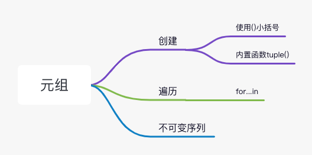
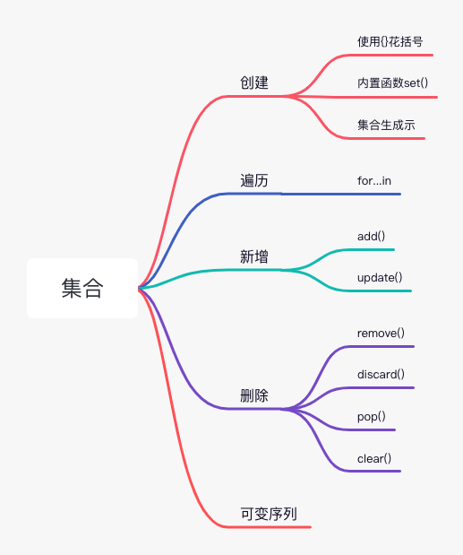

# 列表-字典-元组-集合总结
    

| 数据结构 | 是否可变 | 是否重复 | 是否有序 | 定义符号 |
| ------ | ------ | ------ | ------ | ------ |
| 列表(list) | 可变 | 可重复 | 有序 | [] |
| 元组(tuple) | 不可变 | 可重复 |有序 | ()|
| 字典(dict) | 可变 | key不可重复 , value可重复 |无序 | {key:value}} |
| 集合(set) | 可变 | 不可重复 |无序 | {}} |

